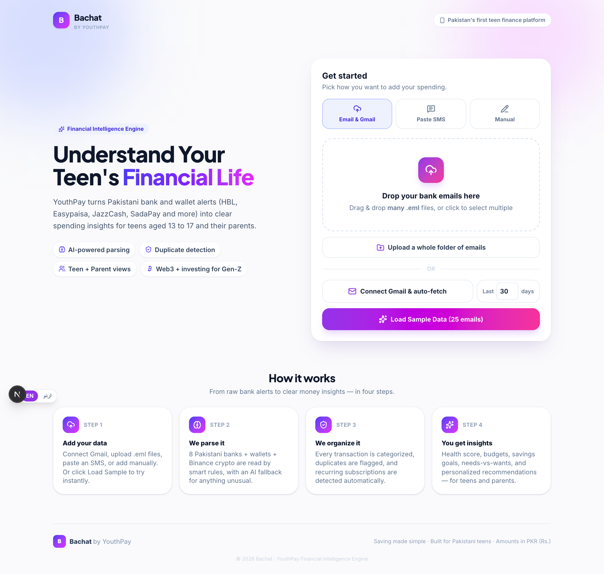
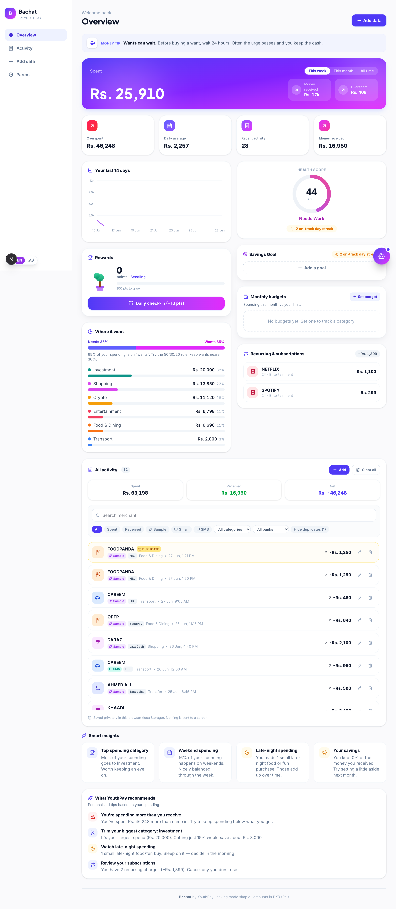
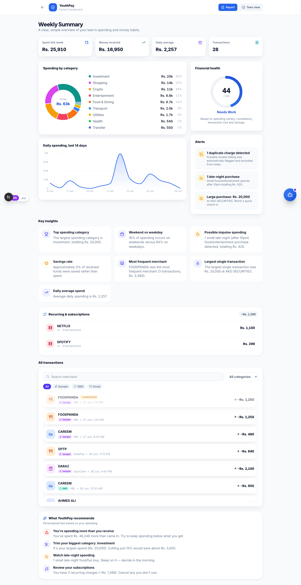
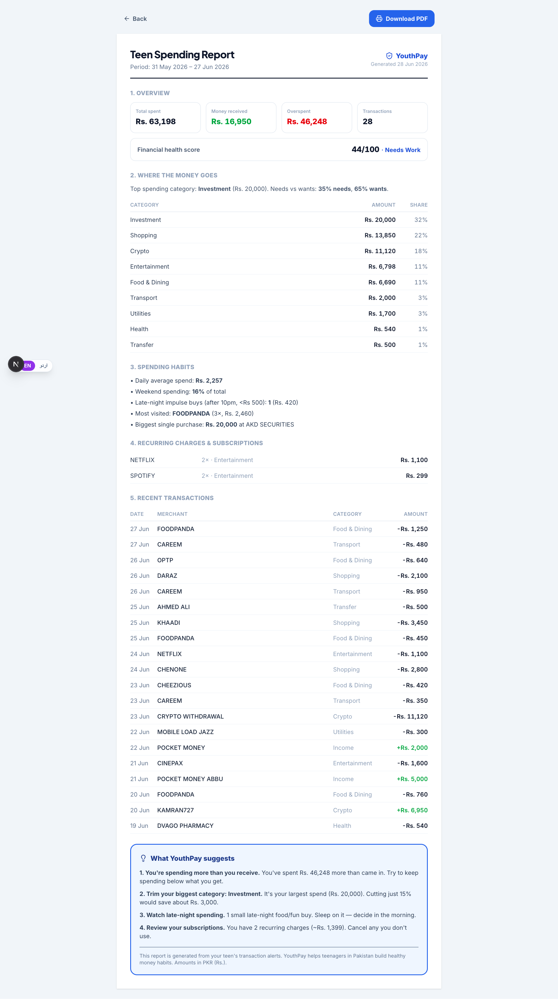

# Bachat — by YouthPay 🌱

**Pakistan's financial-intelligence app for teenagers (13–17).**
Bachat ("savings" in Urdu) turns messy bank, wallet, and crypto transaction
**emails / SMS** into a clean, friendly money dashboard — with categorization,
insights, budgets, savings goals, and personalized recommendations.

> Saving made simple — for teens, and for the parents who guide them.

---

## ✨ Live demo

- **App:** `https://youthpay-hackathon.vercel.app`
- Click **Load Sample Data** on the home page to explore instantly (no setup).

### Screenshots

| Landing | Teen dashboard (Bachat) |
|---|---|
|  |  |

| Parent dashboard | Parent PDF report |
|---|---|
|  |  |

---

## The flow (challenge brief)

```
Email / SMS / Gmail / manual  →  Parse  →  Organize & categorize
        →  Analyze behaviour  →  Generate insights  →  Clean dashboard
```

The dashboard doesn't just show charts — it answers:
- **Where is the money going?** (category breakdown + needs vs wants)
- **What habits can improve?** (weekend-heavy, late-night impulse, big purchases)
- **Is there impulse spending?** (after-10pm small food/fun buys)
- **How much is saved?** (net flow, goals, overspend warning)
- **What would YouthPay advise?** (personalized recommendations)

## How it works
1. **Add data** — Connect Gmail (auto-fetch), upload `.eml` files / a folder, paste an SMS, or add manually.
2. **Parse** — 8 Pakistani banks + wallets + Binance crypto via smart rules, with a **Gemini AI fallback** for unusual formats.
3. **Organize** — auto-categorize, flag duplicates, detect recurring subscriptions/EMIs.
4. **Insights** — health score, budgets, savings goals, needs-vs-wants, recommendations — for teen and parent.

---

## Features

**Ingestion (multi-source)**
- 📥 **Gmail auto-fetch** (OAuth 2.0) — reads real bank-alert emails *(the "big plus")*
- 📎 `.eml` upload (single, multi, or whole folder) with full MIME/base64 parsing
- 💬 SMS paste (most PK bank alerts are SMS)
- ✍️ Manual entry

**Parsing & intelligence**
- 🏦 HBL · UBL · Meezan · Easypaisa · JazzCash · SadaPay · NayaPay · Standard Chartered
- ₿ **Web3/crypto** — Binance USDT/BTC/ETH… auto-detected and converted to PKR
- 📈 **Investment auto-detect** — AKD Securities, brokers, mutual funds → "Investment"
- 🤖 Regex-first, **Gemini AI fallback** when confidence < 0.7
- 🔁 Duplicate detection (same merchant + amount within 2 min)
- 🔁 Recurring / subscription / EMI detection

**Teen dashboard (Bachat)**
- Spending health score, period toggle (week/month/all)
- 💰 Category budgets with over/near alerts
- 🎯 Multiple savings goals (contribute, complete, surplus)
- 🌳 Rewards: a money-tree that grows with daily check-ins + points
- 📚 Money lesson of the day, smart insights, needs-vs-wants
- 🤖 AI money coach (chat over your own data)
- 🗂 Full activity: search, filter (type/source/category/bank), add/edit/delete

**Parent dashboard**
- 🔒 PIN-gated, trustworthy blue theme
- Weekly summary, alerts, category breakdown, health
- 🔎 Searchable, filterable transactions
- 📄 **PDF report** — complete details + YouthPay recommendations

**Polish**
- 🌐 Bilingual (English / Roman Urdu)
- 📱 Mobile-first, responsive
- ⚡ localStorage-first (instant, reliable demo) — optional Supabase persistence

---

## Tech stack
Next.js 16 (App Router, JS) · React 19 · Tailwind v4 · Recharts · Gemini API · Supabase (optional).

## Run locally
```bash
npm install
cp .env.example .env     # add keys (optional — sample data needs none)
npm run dev              # http://localhost:3000
```
Then click **Load Sample Data**.

## Environment variables
See `.env.example`. All optional for the sample-data demo:
- `GEMINI_API_KEY` — AI coach + parse fallback (free key from aistudio.google.com). If absent or rate-limited, the app uses a built-in deterministic fallback, so it always works.
- `GOOGLE_CLIENT_ID` / `GOOGLE_CLIENT_SECRET` / `GOOGLE_REDIRECT_URI` — Gmail auto-fetch
- `NEXT_PUBLIC_SUPABASE_URL` / `NEXT_PUBLIC_SUPABASE_ANON_KEY` — optional cloud persistence

## Deploy (Vercel)
1. Import the repo on vercel.com → Deploy.
2. Add the env vars above (Settings → Environment Variables).
3. Set `GOOGLE_REDIRECT_URI=https://YOUR-APP.vercel.app/api/gmail/callback` and add that URI in Google Cloud Console → Credentials.
4. Redeploy. Works fully on localStorage even without Supabase.

## Supabase (optional)
Run the 2-table schema (`emails`, `transactions`) in the Supabase SQL editor, paste the URL + anon key into env — the pipeline then best-effort persists to the DB.

## Security
- `.env*` and `*.eml` are gitignored — no secrets or personal account data are committed.

---

Built for the YouthPay challenge · Amounts in PKR (Rs.) · Made for Pakistani teens.
