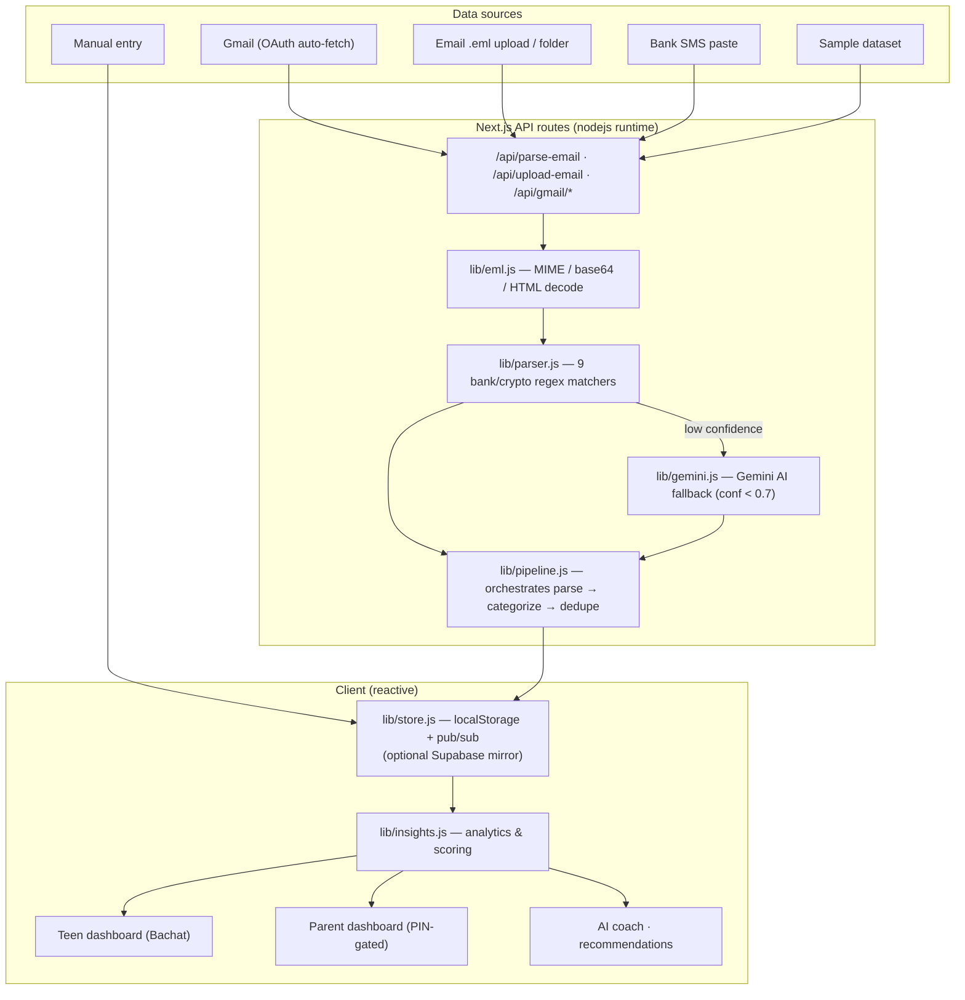

# Bachat Technical Architecture & Write-up

> Bachat ("savings" in Urdu) by YouthPay, a financial-intelligence app that turns
> Pakistani bank / wallet / crypto transaction **emails & SMS** into clear money
> insights for teenagers (13–17) and their parents.

- **Live:** https://youthpay-hackathon.vercel.app
- **Repo:** https://github.com/Cyber-Naimo/youthpay-hackathon
- **Demo (Loom):** https://www.loom.com/share/22e295fab6e44d8bb5039efb555f1206

---

## 1. The problem

Pakistani teens are getting their first bank accounts, wallets (Easypaisa,
JazzCash, SadaPay, NayaPay), and even crypto, but **no tool helps them
understand their money**. Banks send raw alert **emails and SMS** that nobody
reads. Parents have zero visibility. Financial literacy is low.

**Insight:** the data already exists in every teen's inbox. The job isn't to add
another bank, it's to **parse the messages they already receive** and turn them
into understanding + good habits.

So Bachat is built around the *pipeline*, not just a dashboard:

```
Ingest  →  Parse  →  Categorize  →  De-duplicate  →  Analyze  →  Insights  →  Dashboards
```

---

## 2. System architecture



### Layers
| Layer | Files | Responsibility |
|---|---|---|
| **Ingestion** | `app/api/gmail/*`, `upload-email`, `parse-email` | OAuth, file/SMS intake |
| **Decoding** | `lib/eml.js` | RFC822 MIME, base64, quoted-printable, HTML→text |
| **Parsing** | `lib/parser.js` | Per-bank regex; currency-agnostic; SMS-tolerant |
| **AI fallback** | `lib/gemini.js`, `lib/coach.js` | Gemini for unparseable formats + the money coach |
| **Pipeline** | `lib/pipeline.js` | parse → categorize → dedupe → tag source |
| **Categorize** | `lib/categorizer.js` | word-boundary keyword rules (incl. Investment) |
| **Crypto** | `lib/crypto.js` | USDT/BTC/… → PKR conversion |
| **Persistence** | `lib/store.js` | localStorage source-of-truth + pub/sub; Supabase optional |
| **Analytics** | `lib/insights.js` | health score, needs/wants, recurring, recommendations, forecasts |
| **UI** | `app/*`, `components/*` | Two dashboards, report, coach, gamification |

---

## 3. Key engineering decisions (and trade-offs)

**localStorage-first, Supabase optional.** The demo must work instantly for a
judge with zero setup. localStorage is the source of truth via a tiny **pub/sub
store** (`subscribe`/`emit`) so every view stays in sync reactively. Supabase is
wired (best-effort write) but never required. *Trade-off:* per-browser data, not
cross-device — acceptable for an MVP; the DB path is one env var away.

**Regex-first, AI-second.** Deterministic per-bank regex parses known formats
fast and free; **Gemini only fires when confidence < 0.7**. This keeps it cheap,
fast, offline-capable, and resilient when the AI is rate-limited (graceful
deterministic fallback). *Trade-off:* new bank formats need a matcher or rely on
AI — mitigated by the fallback.

**Reuse the same pipeline for every source.** Gmail pulls raw RFC822 (`format=raw`)
and feeds the **exact same** `eml.js` → `parser.js` path as uploads. One code
path, less surface area, consistent results.

**Idempotent ingestion.** `mergeTransactions` skips rows already imported
(merchant + amount + timestamp + source) so auto-sync/polling never piles up
duplicates, while genuine same-day double-charges (different time) are still kept
and flagged.

**Money-literacy over chart-dumping.** Per the brief ("not AI-generated
dashboards with dozens of generic charts"), every widget answers a question:
*needs vs wants*, *recurring subscriptions*, *health score*, *recommendations* —
not decoration.

---

## 4. Notable features (depth, not breadth-for-its-own-sake)
- **9 parsers**: HBL, UBL, Meezan, Easypaisa, JazzCash, SadaPay, NayaPay, Standard Chartered, **Binance (crypto)**.
- **Web3**: crypto emails auto-detected, converted to PKR, kept identifiable.
- **Investment auto-detect**: brokers/funds (AKD, mutual funds, Roshan Digital) → rewarded in health score.
- **Gmail auto-sync**: connect once → silent fetch + 5-min poll, throttled, idempotent.
- **AI money coach**: Gemini chat grounded in the user's own data (+ deterministic fallback).
- **Gamification**: a money-tree that grows with a daily check-in streak.
- **Parent**: PIN-gated, PDF report, alerts, searchable transactions.
- **Bilingual** English / Roman Urdu. **Mobile-first**, responsive masonry.

---

## 5. Scalability path (beyond the MVP)
- **Persistence:** flip on Supabase (schema in README) → per-user rows + RLS.
- **Auth:** replace PIN gate with Supabase Auth + parent→teen invite codes.
- **Real-time Gmail:** Gmail `watch` + Google Pub/Sub webhook for instant push (today: 5-min poll).
- **Parsing at scale:** move matchers to a config/registry; add a feedback loop that promotes AI-parsed formats into regex.
- **Live FX:** replace fixed crypto rates with a cached price API.

---

## 6. How the evaluation criteria are addressed
| Criterion (weight) | How Bachat scores |
|---|---|
| **Product thinking (25%)** | Solves the real gap (unreadable alerts → understanding); needs-vs-wants, budgets, recommendations, parent visibility — chosen over generic charts |
| **Technical execution (20%)** | Clean layered pipeline, reactive pub/sub store, MIME parser, regex+AI hybrid, idempotent sync, 0 build errors |
| **Full-stack (15%)** | Frontend (Next/React/Tailwind), backend (API routes, OAuth), AI (Gemini), DB (Supabase optional), APIs (Gmail), deploy (Vercel) |
| **UX (15%)** | Teen vs parent experiences, bilingual, loaders, PIN, PDF, "a 15-yo and a parent can both use it" |
| **Speed & prioritization (10%)** | Shipped the pipeline + 2 dashboards first; localStorage to avoid auth yak-shaving; AI as enhancement not dependency |
| **Founder mindset (10%)** | Went beyond brief: crypto, investments, gamification, auto-sync, recommendations, scam tips |
| **Presentation (5%)** | This doc + slide deck + Loom + clean README |
